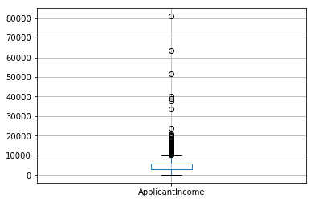
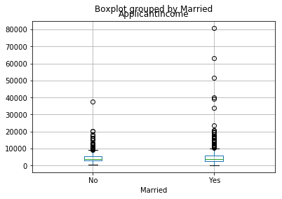
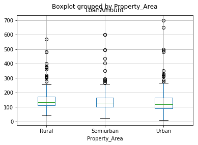
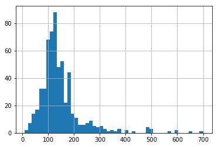
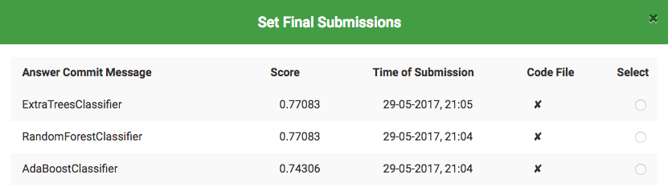
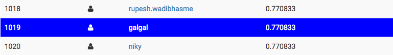

# Assignment 4 - Machine Learning With Python

### Gal Bar 200462133, Gal Steimberg 201253572

In this assignment we will explore the dataset given in the Analytics Vidhya Loaning Prediction competition.

In the first phase we will explore the data, extract some meta data on it, and try to understand some relations bewtween the different attributes.

Next, we will train *three* different classifiers and extract some statisitcs on their quality and accuracy. Then we will use these classifiers to try to predict the loan on the test set.

Lastly, we will upload our results to Analytics Vidhya and present our results.


```python
%pylab inline
```

    Populating the interactive namespace from numpy and matplotlib


First we will import pandas which will help us with I/O.

We will read the training and test set into two variables which we will manilpulate later on.


```python
import pandas as pd
```


```python
df = pd.read_csv("/Users/Gal/Downloads/data/train.csv")

tf = pd.read_csv("/Users/Gal/Downloads/data/test.csv")
```

## Data Exploration

Let understand the data a bit before moving on. First lets look at the first couple of rows in the data:


```python
df.head(2)
```


<div>
<table border="1" class="dataframe">
  <thead>
    <tr style="text-align: right;">
      <th></th>
      <th>Loan_ID</th>
      <th>Gender</th>
      <th>Married</th>
      <th>Dependents</th>
      <th>Education</th>
      <th>Self_Employed</th>
      <th>ApplicantIncome</th>
      <th>CoapplicantIncome</th>
      <th>LoanAmount</th>
      <th>Loan_Amount_Term</th>
      <th>Credit_History</th>
      <th>Property_Area</th>
      <th>Loan_Status</th>
    </tr>
  </thead>
  <tbody>
    <tr>
      <th>0</th>
      <td>LP001002</td>
      <td>Male</td>
      <td>No</td>
      <td>0</td>
      <td>Graduate</td>
      <td>No</td>
      <td>5849</td>
      <td>0.0</td>
      <td>NaN</td>
      <td>360.0</td>
      <td>1.0</td>
      <td>Urban</td>
      <td>Y</td>
    </tr>
    <tr>
      <th>1</th>
      <td>LP001003</td>
      <td>Male</td>
      <td>Yes</td>
      <td>1</td>
      <td>Graduate</td>
      <td>No</td>
      <td>4583</td>
      <td>1508.0</td>
      <td>128.0</td>
      <td>360.0</td>
      <td>1.0</td>
      <td>Rural</td>
      <td>N</td>
    </tr>
  </tbody>
</table>
</div>


```python
df.boxplot(column='ApplicantIncome')
```


    <matplotlib.axes._subplots.AxesSubplot at 0x1190ab320>





This confirms the presence of a lot of outliers/extreme values. This can be attributed to the income disparity in the society. Part of this can be driven by the fact that we are looking at people with different Marriage situation. Let us segregate them by Marriage:


```python
df.boxplot(column='ApplicantIncome', by = 'Married')
```


    <matplotlib.axes._subplots.AxesSubplot at 0x1191e2208>





Lets try to see how the property area attribute effects the Loan Amount given:


```python
df.boxplot(column='LoanAmount', by = 'Property_Area')
```


    <matplotlib.axes._subplots.AxesSubplot at 0x1191eff60>





```python
df['LoanAmount'].hist(bins=50)
```


    <matplotlib.axes._subplots.AxesSubplot at 0x1193a0c88>





### Dealing with missing values

We need to make sure that we fill the missing values so that we can train our classifier properly.


```python
# Check how many values are missing

df.apply(lambda x: sum(x.isnull()),axis=0)
```


    Loan_ID               0
    Gender               13
    Married               3
    Dependents           15
    Education             0
    Self_Employed        32
    ApplicantIncome       0
    CoapplicantIncome     0
    LoanAmount           22
    Loan_Amount_Term     14
    Credit_History       50
    Property_Area         0
    Loan_Status           0
    dtype: int64


```python
# Fill in the missing values according to some logic appropriate for
# each attribute

df['LoanAmount'].fillna(df['LoanAmount'].mean(), inplace=True)
df['Dependents'].fillna(0, inplace=True)
df['Loan_Amount_Term'].fillna(360, inplace=True)
df['Self_Employed'].fillna('Yes',inplace=True)
df['Credit_History'].fillna('1.0',inplace=True)
df['Gender'].fillna('Male',inplace=True)
df['Married'].fillna('No', inplace=True)
```

### Converting string attributes

We need to make sure that we conver string values in the dataset to numerical values.


```python
from sklearn.preprocessing import LabelEncoder
le = LabelEncoder()

# all the string variables
strings = ['Married','Self_Employed','Education','Property_Area','Dependents','Loan_Status','Gender']

for string in strings:
    df[string] = le.fit_transform(df[string].astype(str))
```


```python
# check that we indeed have all the values and numerics

df.head(10)
```


<div>
<table border="1" class="dataframe">
  <thead>
    <tr style="text-align: right;">
      <th></th>
      <th>Loan_ID</th>
      <th>Gender</th>
      <th>Married</th>
      <th>Dependents</th>
      <th>Education</th>
      <th>Self_Employed</th>
      <th>ApplicantIncome</th>
      <th>CoapplicantIncome</th>
      <th>LoanAmount</th>
      <th>Loan_Amount_Term</th>
      <th>Credit_History</th>
      <th>Property_Area</th>
      <th>Loan_Status</th>
    </tr>
  </thead>
  <tbody>
    <tr>
      <th>0</th>
      <td>LP001002</td>
      <td>1</td>
      <td>0</td>
      <td>0</td>
      <td>0</td>
      <td>0</td>
      <td>5849</td>
      <td>0.0</td>
      <td>146.412162</td>
      <td>360.0</td>
      <td>1</td>
      <td>2</td>
      <td>1</td>
    </tr>
    <tr>
      <th>1</th>
      <td>LP001003</td>
      <td>1</td>
      <td>1</td>
      <td>1</td>
      <td>0</td>
      <td>0</td>
      <td>4583</td>
      <td>1508.0</td>
      <td>128.000000</td>
      <td>360.0</td>
      <td>1</td>
      <td>0</td>
      <td>0</td>
    </tr>
    <tr>
      <th>2</th>
      <td>LP001005</td>
      <td>1</td>
      <td>1</td>
      <td>0</td>
      <td>0</td>
      <td>1</td>
      <td>3000</td>
      <td>0.0</td>
      <td>66.000000</td>
      <td>360.0</td>
      <td>1</td>
      <td>2</td>
      <td>1</td>
    </tr>
    <tr>
      <th>3</th>
      <td>LP001006</td>
      <td>1</td>
      <td>1</td>
      <td>0</td>
      <td>1</td>
      <td>0</td>
      <td>2583</td>
      <td>2358.0</td>
      <td>120.000000</td>
      <td>360.0</td>
      <td>1</td>
      <td>2</td>
      <td>1</td>
    </tr>
    <tr>
      <th>4</th>
      <td>LP001008</td>
      <td>1</td>
      <td>0</td>
      <td>0</td>
      <td>0</td>
      <td>0</td>
      <td>6000</td>
      <td>0.0</td>
      <td>141.000000</td>
      <td>360.0</td>
      <td>1</td>
      <td>2</td>
      <td>1</td>
    </tr>
    <tr>
      <th>5</th>
      <td>LP001011</td>
      <td>1</td>
      <td>1</td>
      <td>2</td>
      <td>0</td>
      <td>1</td>
      <td>5417</td>
      <td>4196.0</td>
      <td>267.000000</td>
      <td>360.0</td>
      <td>1</td>
      <td>2</td>
      <td>1</td>
    </tr>
    <tr>
      <th>6</th>
      <td>LP001013</td>
      <td>1</td>
      <td>1</td>
      <td>0</td>
      <td>1</td>
      <td>0</td>
      <td>2333</td>
      <td>1516.0</td>
      <td>95.000000</td>
      <td>360.0</td>
      <td>1</td>
      <td>2</td>
      <td>1</td>
    </tr>
    <tr>
      <th>7</th>
      <td>LP001014</td>
      <td>1</td>
      <td>1</td>
      <td>3</td>
      <td>0</td>
      <td>0</td>
      <td>3036</td>
      <td>2504.0</td>
      <td>158.000000</td>
      <td>360.0</td>
      <td>0</td>
      <td>1</td>
      <td>0</td>
    </tr>
    <tr>
      <th>8</th>
      <td>LP001018</td>
      <td>1</td>
      <td>1</td>
      <td>2</td>
      <td>0</td>
      <td>0</td>
      <td>4006</td>
      <td>1526.0</td>
      <td>168.000000</td>
      <td>360.0</td>
      <td>1</td>
      <td>2</td>
      <td>1</td>
    </tr>
    <tr>
      <th>9</th>
      <td>LP001020</td>
      <td>1</td>
      <td>1</td>
      <td>1</td>
      <td>0</td>
      <td>0</td>
      <td>12841</td>
      <td>10968.0</td>
      <td>349.000000</td>
      <td>360.0</td>
      <td>1</td>
      <td>1</td>
      <td>0</td>
    </tr>
  </tbody>
</table>
</div>


```python
df.dtypes
```


    Loan_ID               object
    Gender                 int64
    Married                int64
    Dependents             int64
    Education              int64
    Self_Employed          int64
    ApplicantIncome        int64
    CoapplicantIncome    float64
    LoanAmount           float64
    Loan_Amount_Term     float64
    Credit_History        object
    Property_Area          int64
    Loan_Status            int64
    dtype: object


One intuition can be that some applicants have lower income but strong support Co-applicants. So it might be a good idea to combine both incomes as total income and take a log transformation of the same.

Also, to deal with extreme values lets use the log function on the Total Income to nullify the extreme values effect.


```python
df['TotalIncome'] = df['ApplicantIncome'] + df['CoapplicantIncome']
df['TotalIncome_log'] = np.log(df['TotalIncome'])
```


```python
df.dtypes
```


    Loan_ID               object
    Gender                 int64
    Married                int64
    Dependents             int64
    Education              int64
    Self_Employed          int64
    ApplicantIncome        int64
    CoapplicantIncome    float64
    LoanAmount           float64
    Loan_Amount_Term     float64
    Credit_History        object
    Property_Area          int64
    Loan_Status            int64
    TotalIncome          float64
    TotalIncome_log      float64
    dtype: object


## Preparing the test set

Here we will perform all the tranformations and manipulations that we performed on the train set to the test set


```python
tf.apply(lambda x: sum(x.isnull()),axis=0)

tf['LoanAmount'].fillna(tf['LoanAmount'].mean(), inplace=True)
tf['Dependents'].fillna(0, inplace=True)
tf['Loan_Amount_Term'].fillna(360, inplace=True)
tf['Self_Employed'].fillna('Yes',inplace=True)
tf['Credit_History'].fillna('1.0',inplace=True)
tf['Gender'].fillna('Male',inplace=True)
tf['Married'].fillna('No', inplace=True)

le = LabelEncoder()

strings = ['Married','Self_Employed','Education','Property_Area','Dependents','Gender']

for string in strings:
    tf[string] = le.fit_transform(tf[string].astype(str))
    
tf['TotalIncome'] = tf['ApplicantIncome'] + tf['CoapplicantIncome']
tf['TotalIncome_log'] = np.log(tf['TotalIncome'])

df.dtypes
```


    Loan_ID               object
    Gender                 int64
    Married                int64
    Dependents             int64
    Education              int64
    Self_Employed          int64
    ApplicantIncome        int64
    CoapplicantIncome    float64
    LoanAmount           float64
    Loan_Amount_Term     float64
    Credit_History        object
    Property_Area          int64
    Loan_Status            int64
    TotalIncome          float64
    TotalIncome_log      float64
    dtype: object


## Building Models and Analyzing Results


```python
#Import models from scikit learn module:
from sklearn.linear_model import LogisticRegression
from sklearn.cross_validation import KFold   #For K-fold cross validation
from sklearn.ensemble import RandomForestClassifier
from sklearn.tree import DecisionTreeClassifier, export_graphviz
from sklearn import metrics

#Generic function for making a classification model and accessing performance:
def classification_model(name, model, data, predictors, outcome):
  #Fit the model:
  model.fit(data[predictors],data[outcome])
  
  #Make predictions on training set:
  predictions = model.predict(data[predictors])

  #Print accuracy
  accuracy = metrics.accuracy_score(predictions,data[outcome])
  print("Accuracy : %s" % "{0:.3%}".format(accuracy))

  #Perform k-fold cross-validation with 5 folds
  kf = KFold(data.shape[0], n_folds=5)
  error = []
  for train, test in kf:
    # Filter training data
    train_predictors = (data[predictors].iloc[train,:])
    
    # The target we're using to train the algorithm.
    train_target = data[outcome].iloc[train]
    
    # Training the algorithm using the predictors and target.
    model.fit(train_predictors, train_target)
    
    #Record error from each cross-validation run
    error.append(model.score(data[predictors].iloc[test,:], data[outcome].iloc[test]))
 
  print("Cross-Validation Score : %s" % "{0:.3%}".format(np.mean(error)))

    
  #Fit the model again so that it can be refered outside the function:
  model.fit(data[predictors],data[outcome])

```

Lets first seperate our predicitng attributes and our outcome attribute into two different lists:


```python
predictor_var = ['Gender', 'Married', 'Dependents', 'Education',
       'Self_Employed', 'Loan_Amount_Term', 'Credit_History', 'Property_Area','TotalIncome_log']
outcome_var = 'Loan_Status'
```

### Submission 1 - RandomForestClassifier

Random forests or random decision forests are an ensemble learning method for classification, regression and other tasks, that operate by constructing a multitude of decision trees at training time and outputting the class that is the mode of the classes (classification) or mean prediction (regression) of the individual trees. Random decision forests correct for decision trees' habit of overfitting to their training set.


```python
#Build
model_rf = RandomForestClassifier(n_estimators=1000, random_state=1, max_features='auto', min_samples_split=10, min_samples_leaf=1)

#Analyze
classification_model('RandomForestClassifier',model_rf, df, predictor_var, outcome_var)

#Train
prediction_rf = model_rf.predict(tf[predictor_var])

# Change back to expected format
prediction_rf = ["Y" if i == 1 else "N" for i in prediction_rf]
```

    Accuracy : 85.831%
    Cross-Validation Score : 78.994%


### Submission 2 - ExtraTreesClassifier

An extremely randomized tree classifier.
Extra-trees differ from classic decision trees in the way they are built. When looking for the best split to separate the samples of a node into two groups, random splits are drawn for each of the max_features randomly selected features and the best split among those is chosen. When max_features is set 1, this amounts to building a totally random decision tree.


```python
from sklearn.ensemble import ExtraTreesClassifier

#Build
model_etc = ExtraTreesClassifier(bootstrap=True, max_features='auto', min_samples_split=10,n_estimators=1000,max_depth=None)

#Analyze
classification_model('ExtraTreesClassifier',model_etc, df, predictor_var, outcome_var)

#Train
prediction_etc = model_etc.predict(tf[predictor_var])

# Change back to expected format
prediction_etc = ["Y" if i == 1 else "N" for i in prediction_etc]
```

    Accuracy : 83.550%
    Cross-Validation Score : 80.457%


### Submission 3 - AdaBoostClassifier

AdaBoos is a ML algorithm that can be used in conjunction with many other types of learning algorithms to improve their performance. The output of the other learning algorithms ('weak learners') is combined into a weighted sum that represents the final output of the boosted classifier. AdaBoost is adaptive in the sense that subsequent weak learners are tweaked in favor of those instances misclassified by previous classifiers. AdaBoost is sensitive to noisy data and outliers. In some problems it can be less susceptible to the overfitting problem than other learning algorithms. The individual learners can be weak, but as long as the performance of each one is slightly better than random guessing (e.g., their error rate is smaller than 0.5 for binary classification), the final model can be proven to converge to a strong learner.


```python
from sklearn.ensemble import AdaBoostClassifier

#Build
model_ada = AdaBoostClassifier(n_estimators=100, learning_rate=0.5)

#Analyze
classification_model('AdaBoostClassifier',model_ada, df, predictor_var, outcome_var)

#Train
prediction_ada = model_ada.predict(tf[predictor_var])

# Change back to expected format
prediction_ada = ["Y" if i == 1 else "N" for i in prediction_ada]
```

    Accuracy : 82.736%
    Cross-Validation Score : 79.969%


Save the results of each classifier to .csv file ready for submission.


```python
pd.DataFrame({'Loan_ID':tf.Loan_ID,'Loan_Status':prediction_rf}).to_csv('/Users/Gal/Downloads/data/RandomForestClassifier.csv',index=False)
pd.DataFrame({'Loan_ID':tf.Loan_ID,'Loan_Status':prediction_ada}).to_csv('/Users/Gal/Downloads/data/AdaBoostClassifier.csv',index=False)
pd.DataFrame({'Loan_ID':tf.Loan_ID,'Loan_Status':prediction_etc}).to_csv('/Users/Gal/Downloads/data/ExtraTreesClassifier.csv',index=False)
```

You can find all the three submission files in the git repository.

#### [AdaBoostClassifier](https://github.com/galst/results/AdaBoostClassifier.csv)
#### [ExtraTreesClassifier](https://github.com/galst/results/ExtraTreesClassifier.csv)
#### [RandomForestClassifier](https://github.com/galst/results/RandomForestClassifier.csv)


## Results

Our username : **galgal**

We submitted three results (one for each classifier we trained)





